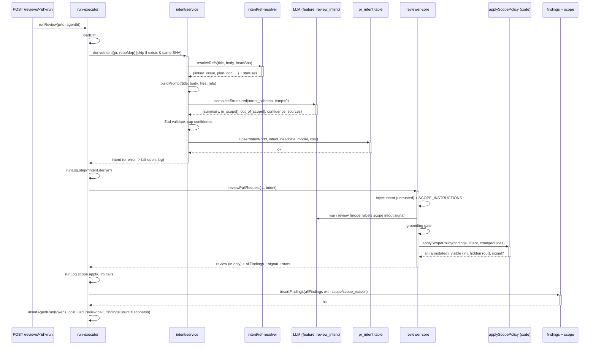

# Intent Layer Development Plan

## 1. Goals & Requirements

**Goal:** Classify PR motivation (summary, in-scope/out-of-scope intent) from PR metadata (title, body, linked issue, plan/spec, file list) using a cheap flash LLM, store on the PR, inject into review, and filter out-of-scope findings from results.

**Inputs:** PR title, body, files with hunk headers (`@@`), linked-issue title/body, plan/spec document (if found), head SHA.  
**NOT inputs:** Diff bodies, code, comments.

**Outputs:** Intent {summary, in_scope[], out_of_scope[], confidence 0–1, sources[], missing_context[]}.  
**Artifacts:** Flash-model endpoint (via OpenRouter feature model `review_intent`), new API `/pulls/:id/intent`, scope policy (code-owned `applyScopePolicy`, no judge call), UI card on PR Overview, stale detection (new head SHA).

**Requirements mapping:**
- [x] Flash model via OpenRouter (separate setting from main review model, feature-model slot `review_intent`)
- [x] Input: title, body, files+hunk-headers (no bodies), ticket/plan/spec (GitHub only, no arbitrary HTTP)
- [x] Output schema with summary, in_scope[], out_of_scope[], confidence, sources, missing_context
- [x] Empty description mode: intent from file names only, confidence capped at 0.4
- [x] Reference links (plan/spec/ticket) required; unavailable marked as "no context" (not guessed)
- [x] Stored on PR (replaces hardcoded intent, re-derivable on manual trigger)
- [x] Out-of-scope findings hidden by code-owned policy; one signal kept for a serious (CRITICAL) out-of-scope finding; security/secret_leak/lethal_trifecta/CRITICAL-on-changed-lines are never out (differs from the original judge design, see section 5)
- [x] Manual re-derive button (after PR update)

### Status: remaining work (everything else below is implemented and verified against code)
- [x] Fallback to the main review model (with a runLog warning) if the flash model's provider cannot be set up (`IntentService` `opts.fallback`; executor passes the first agent's model, the route the workspace's first enabled agent). Only provider setup failures fall back, not LLM call errors
- [x] Confidence 0.0 when the description is empty and no external source (issue/plan/spec) was fetched; 0.4 cap if one was fetched
- [x] GitHub URL issue parsing (`extractIssueRef`): body + title, keyword > URL/`owner/repo#N` > bare `#N`, same repo only (other repos marked `unavailable`, never fetched)
- [x] Rate limit 1 per 30s per PR (in-memory, per process) and `retry_after` on POST `/pulls/:id/intent/derive` (429 and 502); optional `force` bypasses the cache. The client Re-derive button sends `force: true` and shows the rate-limit message
- [x] `withTimeout(30s)` + `withRetry(3)` for `getIssue`/`readRepoFile` at the Octokit adapter level; `readRepoFile` now returns null only for 404/410 and throws otherwise, so source status `error` is reachable; persisted `sources` are code-owned (RefResolver statuses), referenced-but-unavailable sources are rendered as "no context" in the prompt
- [ ] Trace `intent_step` and intent cost in `agent_runs.cost_usd` (OPEN QUESTION: needs a shared-contract change, `server/src/vendor/shared` is read-only per CLAUDE.md:60; trace totals exclude intent cost, which lives only in the runLog and `pr_intent`)
- [ ] Cache check before ref fetch (deliberately not done: the cache key hashes issue/plan content, so refs must be fetched first)
- [x] RunLogger steps `intent.load` / `intent.resolve_refs`; `intent.derive` now also logs provider/model, prompt composition, est./actual tokens, cost and warnings (>= 100 files, fallback) in the message text. Intent cost is logged and stored on `pr_intent` only
- [ ] `reviewer-core/src/intent/derive.ts` (derivation runs in `server/src/modules/intent/service.ts`; reviewer-core only has `prompt-builder.ts`)
- [ ] Phase 6: e2e spec for intent derive/re-derive, seeded-fixture update, `docs/agent-prompts/README.md` intent injection note
- [x] Intent route tests (`server/test/intent-routes.test.ts`, fake Db + `app.inject`; not a DB integration test)
- [ ] CI check for `server/src/vendor/shared` vs `client/src/vendor/shared` drift. Currently and `client/src/vendor/shared` differ in several files (adapters, eval-ci, knowledge, productionize, trace); not caused by this feature, not checked per file
- [ ] Shared scope predicate (needs a shared-contract change)
- [ ] Remove remaining `as` casts in `ModelReviewSchema` (needs `StructuredRequest<T, I>` in shared)

### Scope design change
The separate scope-judge LLM call was dropped. The review model labels each finding (`scope`, `scope_reason`); `applyScopePolicy` decides. Exactly two model calls per single-pass run (intent classifier + main review; map-reduce = one review call per chunk; cached intent = no classifier call). See `docs/intent-layer.md` for the implemented behaviour; sections 3, 4, 5, 10 below are updated accordingly.

---

## 2. Data Sources & Limits

### PR Data
- **PR title & body:** fetched via OctokitGitHubClient, stored in `pull_requests.title` and `.body`
- **Files & hunks:** from `pr_files` table (patch includes `@@` line markers, not paginated at fetch; max 100 files today)
- **Head SHA & base:** tracked in `pull_requests.headSha`, `.base`
- **Linked issue:** regex `/(?:closes|fixes|resolves)?\s*#(\d+)/i` on body (today), cross-repo issues via Octokit `getIssue` return `{number, title, body, state}` (not persisted)

### External refs (GitHub only, no SSRF)
1. **Linked issue:** same or cross-repo via Octokit `getIssue(owner, repo, issue_number)` (already implemented)
2. **Plan/spec:** repo file at head SHA via Octokit `getContent(owner, repo, path, ref: headSha)` (requires explicit path from PR body regex or comment; fetch via `modules/intent/ref-resolver.ts`)
3. **GitHub URLs:** `https://github.com/owner/repo/issues/N` parsed and fetched with Octokit
- **Exclude:** arbitrary HTTP, private IPs, domains outside allowlist (not used; always return unavailable)

### Limits & safety
- **Fetch:** `withTimeout(30s)` + `withRetry(3)` per source
- **Max size:** 64 KB per document (hard cap; docs over 32 KB become head + `[... truncated ...]` + last 1 KB, 32 KB total; over 64 KB the tail is dropped)
- **Untrusted:** PR body, issue title/body, file names, hunk headers passed through `wrapUntrusted` in prompt
- **Cap on confidence:** 0.4 when intent derived from files-only (no PR body), 0.0 if no sources and empty description

---

## 3. Call Sequence (Request to Persist)



---

## 4. Prompt Builder

Location: `reviewer-core/src/intent/` (pure engine, injected LLMProvider).

### Intent derivation prompt
**System:** 3-5 rules (concise, no hallucination warnings—those are in INJECTION_GUARD).
- Output JSON: `{summary: str, in_scope: [str], out_of_scope: [str], confidence: 0..1, sources: [{label, status}], missing_context: [str]}`
- `confidence`: 0–1, cap at 0.4 if PR body empty, omit if no sources.
- `sources`: list of `{label: "Linked issue / Plan at path / ...", status: "fetched" | "unavailable" | "error"}`.
- `missing_context`: items the model wanted but couldn't find (e.g., "specification not found at docs/spec.md").

**User message structure** (in review-core prompt order):
```
## Intent sources
- **PR title:** <title (wrapped untrusted)>
- **PR body:** <body, truncated (wrapped untrusted)>
- **Linked issue:** <issue title + body OR "not found">
- **Plan/spec:** <file content OR "not found/unavailable">
- **Files & hunks:** <list of paths + first 2 hunks per file (wrapped untrusted)>

## Task
Classify the intent of this PR. What is the author trying to accomplish? What is in scope vs. out of scope?
```

**Few-shot examples:** 2 examples covering full description vs. empty-body cases.

### Scope labelling (replaces the judge prompt)
No separate prompt/call. With a structured intent, the main review prompt gets a bounded untrusted `## Intent` section (`renderIntent`: summary 500 chars, 8 items x 120 chars) and the trusted `SCOPE_INSTRUCTIONS` in the system prompt: label each finding `in|out|signal` + one-sentence `scope_reason`; never "out" for security/secrets/CRITICAL defects on lines changed by this PR (new-side hunk ranges, context lines included); report everything. `INJECTION_GUARD` gained a sentence limiting intent to the label. `wrapUntrusted` strips `</untrusted>` case-insensitively.

---

## 5. Scope Policy

Implemented in `reviewer-core/src/review/scope.ts` (`applyScopePolicy`, pure, once over all grounded findings). The model output schema (`ModelReview`) is lenient: `scope` / `scope_reason` `.nullish().catch(null)`.

**Order:**
1. Inactive (no intent, confidence < 0.5, or empty in/out lists) -> all `in`.
2. Normalise hints (missing/invalid -> `in`; model `signal` = `out`).
3. Never-out -> `in`: category `security`; kind `secret_leak` / `lethal_trifecta`; `CRITICAL` overlapping changed lines (new-side hunk ranges).
4. Mass-out guard: outs > 0.6 of total (total >= 3), or all-out with total >= 2 -> everything `in`.
5. CRITICAL outs collapse into one `signal` (confidence desc, then file, line, id); the rest stay `out` (hidden, persisted).
6. Code writes `scope` / `scope_reason` (reason capped at 280 chars).

**Outcome:** `review.findings`, verdict, score, blockers, `findings_count` from `scope=in` only; 0-1 signal reported separately; `out` persisted but hidden (UI reveal toggle). PR-list FINDINGS excludes out/signal.

**Residual risk:** the model can still label a non-CRITICAL finding on changed lines `out` under prompt injection; bounded by the never-out rules and the ratio guard; hidden findings remain revealable.

---

## 6. Database Schema

### Extend `pr_intent` table
Current columns: `prId`, `intent` (text), `inScope[]` (jsonb), `outOfScope[]` (jsonb).

**Add:**
- `summary` (alias for `intent`, for clarity in API/UI)
- `confidence` (float 0–1)
- `sources` (jsonb array of {label, status})
- `missing_context` (jsonb array of strings)
- `basis` (text: "title_body" | "files_only" | "partial_context")
- `derived_from_head_sha` (text, for stale detection)
- `model` (text, feature-model id used)
- `tokens` (int, intent LLM call)
- `cost_usd` (float)
- `derived_by` (text, user id or "auto")
- `updated_at` (timestamp)

### Extend `agent_runs` findings
- `scope` (nullable text: "in" | "out" | "signal")
- `scope_reason` (nullable text, decision + sanitised model reason)
- No change to other columns

### Migration
- `pnpm db:generate` in `server/` to auto-create migration from `server/src/db/schema/reviews.ts` and `findings.ts`
- Never hand-edit migrations; reviewers will catch it
- Generated: `0012` (pr_intent columns, findings scope), `0014_broken_james_howlett` (syncs `pr_intent.summary` default `''` with the schema)

---

## 7. API

### GET /pulls/:id/intent
**Response:**
```json
{
  "pr_id": "uuid",
  "summary": "...",
  "in_scope": ["..."],
  "out_of_scope": ["..."],
  "confidence": 0.85,
  "sources": [
    {"label": "Linked issue", "status": "fetched"},
    {"label": "Plan at docs/spec.md", "status": "unavailable"}
  ],
  "missing_context": ["specification"],
  "stale": false,
  "derived_from_head_sha": "abc123...",
  "model": "openrouter/...",
  "cost_usd": 0.0012,
  "derived_at": "2026-10-03T12:00:00Z"
}
```
- `stale`: true if `derived_from_head_sha !== pull_requests.headSha`
- Returns 200 if intent exists, 404 if never derived

### POST /pulls/:id/intent/derive
**Request:** `{}`  
**Response:** same as GET (immediately derived, or async via long-poll).  
- Scope: authenticated user, rate-limit per PR (max 1 per 30s)
- Cost: counted in PR run stats, not user budget
- Error handling: if LLM call fails, return 502 with `{error, retry_after}`

### Settings: feature_models.review_intent
- Default: changed from `openai/gpt-4.1` to an OpenRouter flash model (e.g., `openrouter/google/gemini-2.5-flash-lite` or equivalent)
- User-changeable via Settings UI (SettingsModels already lists all feature models)
- Fallback: if unavailable, use main review model (with warning)

### Contracts
- `Intent` (vendor/shared/contracts/brief.ts): add confidence, sources, missing_context
- `Finding` (vendor/shared/contracts/findings.ts): add scope, scope_reason (nullable)
- **Mirroring:** update `client/src/vendor/shared` after server changes (explicit task in implementation)

---

## 8. Server-Side Wiring

### New module: `modules/intent`
**Structure:**
- `routes.ts`: GET/POST /pulls/:id/intent endpoints, validation, auth
- `service.ts`: `IntentService.derive(pr, repoMap)`, caching, error handling
- `repository.ts`: CRUD operations on `pr_intent` table (extends existing repo)
- `ref-resolver.ts`: fetch linked issue, plan/spec files, GitHub URLs; withTimeout + withRetry
- `prompt-builder.ts`: pure function (or in reviewer-core) to assemble intent prompt

### Hook in run-executor
**Location:** `server/src/modules/reviews/run-executor.ts` after `loadDiff` (line ~60).

```typescript
// derive intent once per run, before agent loop
if (!intent || intent.derived_from_head_sha !== pull.headSha) {
  intent = await intentService.derive(pull, repoMap);
  runLog.step('intent.derive', {prId, headSha, confidence: intent.confidence});
}
```

- Skip if already derived and SHA matches
- Fail-open: log warning, continue without intent
- Cost added to RunStats

### GitHubClient enhancement
- Add `readRepoFile(owner, repo, path, ref: sha)` wrapper around `getContent` with fetch error handling

---

## 9. Client-Side: UI

### Intent Card on OverviewTab
**Colocated component:** `client/src/app/repos/[repoId]/pulls/[number]/_components/IntentBlock/` (folder, PascalCase component, index.ts, styles.ts, helpers.ts).

**Content:**
- Header: SectionLabel icon="Target" + "Intent"
- Summary: italic quote of `intent.summary`
- Two columns: "IN SCOPE" (green) + "OUT OF SCOPE" (muted)
- Source chips: for each source, show label + status (fetchable icon or ⚠️ unavailable)
- Confidence badge: ConfidenceNum (existing component)
- Stale badge: if `intent.stale`, show warning with "Re-derive" button
- Loading/error/empty states (Skeleton, ErrorState, EmptyState)

**Placement:** OverviewTab component, above Description (or below, per design decision; mock design at `tmp/Dev Digest/screen_pr_detail.jsx:4-20` shows it above Risk areas).

### Findings Panel: Scope Filtering
- New line: "N findings out-of-scope" badge + expand/collapse list (grayed-out)
- One signal finding (if present): "⚠️ Out of scope but serious (CRITICAL/security)" with original finding detail
- i18n key: `prReview.scope.suppressed`

### Settings: (no change)
- `feature_models.review_intent` already exposed in SettingsModels UI

### Hooks
**New hook:** `client/src/lib/hooks/reviews.ts:useIntent(prId)`
- Query key: `["pr-intent", prId]`
- Calls `GET /pulls/:id/intent`
- Returns {intent, isLoading, error}

**Usage:** `IntentBlock` component calls this hook.

### i18n
**File:** `client/messages/en/brief.json` (or `prReview.json`).

Add keys:
```json
{
  "intent": {
    "label": "Intent",
    "inScope": "In Scope",
    "outOfScope": "Out of Scope",
    "stale": "Intent may be stale (PR updated)",
    "rederive": "Re-derive",
    "fetched": "Fetched",
    "unavailable": "Not found"
  },
  "scope": {
    "suppressed": "N findings out of scope",
    "signal": "Out of scope but serious"
  }
}
```

---

## 10. Logging & Observability

### RunLogger integration
**Steps:**
- `intent.load`: load existing intent (if present, skip derive)
- `intent.derive`: derive new intent (LLM call, cost, time)
- `intent.resolve_refs`: fetch linked issue/plan/spec (per source status)
- `scope.apply`: scope policy result (in/out/signal/hidden/collapsed/overrides/guard); engine also emits `Scope policy:` + per-override lines
- `llm.calls`: `llm.calls: intent=<label> review=<n>` where `<label>` separates attempts from outcome: `1 ok`, `N (retried, N attempts) ok`, `0 cached` (no call), `0 skipped` (failed before the LLM call), `1 failed` (call made, errored; 1 is a lower bound because the provider error does not report its attempt count), `N (retried, N attempts) failed`. Defined once in `intentCallsLabel` (`server/src/modules/intent/log-lines.ts`).

**Pino fields (no bodies/secrets):**
```
{
  prId, headSha, model, tokens, costUsd, confidence,
  source_statuses: { linked_issue: "fetched", plan: "unavailable" },
  durationMs, dropped_count, signal_created
}
```

### RunTrace additions
- `intent_step`: {summary, confidence, source_statuses}
- (judge_step removed with the judge; not implemented, not planned)

### Cost accounting
- Intent LLM call: `priceBook.estimate(model, tokens)` (same as review LLM)
- Total added to `agent_runs.cost_usd` (NOT done, open question: needs shared-contract change; intent cost is in the runLog and `pr_intent` only)

---

## 11. Phases & Tests

### Phase 1: Contracts & DB (3 days)
- [x] Extend Intent contract (brief.ts), Finding contract (findings.ts)
- [x] Update vendor/shared in client (findings.ts identical in both copies)
- [x] Schema changes (pr_intent columns, findings scope columns)
- [x] Migration (auto-generated)
- [x] Test: contract validation (`server/test/contracts.test.ts`)

### Phase 2: Reviewer-core Intent Engine (3 days)
- [x] `intent/prompt-builder.ts`: system + user message, few-shot examples
- [ ] `intent/derive.ts`: pure function (LLMProvider injected) - NOT done; derivation is in `server/src/modules/intent/service.ts`
- [x] Scope policy: `review/scope.ts:applyScopePolicy` (replaces `scopeFindings`)
- [x] Extend PromptParts in prompt.ts to inject intent into review (`intentObj`, `renderIntent`, `SCOPE_INSTRUCTIONS`)
- [x] Test: prompt.test.ts, run.test.ts, scope.test.ts, output-schema.test.ts, changed-lines.test.ts

### Phase 3: Server Intent Module & Executor (4 days)
- [x] `modules/intent/`: routes, service, repository, ref-resolver
- [x] GitHubClient file-fetch method (`readRepoFile`)
- [x] run-executor hook (derive once, fail-open)
- [x] GET/POST /pulls/:id/intent endpoints (rate limit + retry_after)
- [x] Feature-model resolution (review_intent setting; main-model fallback in IntentService)
- [x] Test: service.test.ts, ref-resolver.test.ts, `run-executor.intent.test.ts`, `run-executor.scope.test.ts`, `reviews.it.test.ts` (scope persistence)
- [x] Test: intent routes (`server/test/intent-routes.test.ts`)

### Phase 4: Scope policy (2 days; judge call dropped)
- [x] Code-owned policy in reviewer-core after grounding (no judge call)
- [x] Collapse logic (serious CRITICAL outs -> 1 signal; security/secret kinds never out)
- [x] Persist all findings with scope/scope_reason; only `in` counted (verdict/score/blockers/findingsCount/PR-list)
- [x] Test: scope.test.ts, run.test.ts, run-executor.scope.test.ts

### Phase 5: Client UI (3 days)
- [x] IntentBlock component (skeleton, error, empty, loaded states)
- [x] Findings panel scope display (counter + reveal, signal marker, Diff tab hint)
- [x] useIntent hook + query integration
- [x] i18n additions (`prReview.scope.*`, `smartDiff.outOfScopeHidden`)
- [x] Test: IntentBlock.test.tsx, FindingsPanel/FindingCard/DiffTab/ReviewRunAccordion tests

### Phase 6: E2E & docs (2 days)
- [ ] Update seeded fixture (if intent changes expected findings, update 04-pr-findings.flow.json) - not done
- [ ] New e2e spec: derive intent on Overview, manual re-derive - not done
- [ ] Update docs/agent-prompts/README.md (intent injection point) - not done
- [x] Update reviewer-core/specs/review-contract.md (intent input, scope policy); also `docs/intent-layer.md`, `server/specs/review-flow.md`

---

## 12. Risks & Mitigations

| Risk | Impact | Mitigation |
|------|--------|-----------|
| **Prompt injection via PR title/body/hunk/ticket** | Unintended in/out scope classification | Wrap all with `wrapUntrusted`; INJECTION_GUARD already lists intent as untrusted |
| **Confidence calibration off** | Wrong scope decisions, user distrust | Ground calibration on seeded PRs; start with capped 0.4 for files-only; iterate after field feedback |
| **Stale intent** | Decision made from old context, PR evolved | Persist head SHA, show stale badge, offer manual re-derive; executor skips if SHA matches |
| **Wrong out-of-scope label hides a real bug** | Hidden finding (still persisted/revealable) | Code-owned never-out rules (security, secret_leak/lethal_trifecta, CRITICAL on changed lines), mass-out guard 0.6, inactive below confidence 0.5; residual: non-CRITICAL finding on changed lines can still be labelled out |
| **1 extra LLM call (intent classifier)** | +latency/cost per run | Flash model (10x cheaper); cached per head SHA + metadata hash (no call on cache hit) |
| **Contract change ripple** | client vendor copies drift from server | Explicit sync task; CI check for mismatch (cwd=client && diff vendor/shared vs server/src/vendor/shared) |
| **Linked-issue regex miss** | Intent misses relevant context | Regex only handles `#N` same-repo; user can link in title or body URL; log miss |
| **Files >100** | PR files truncated, intent incomplete | Document limit; log warning if count >= 100; track for future pagination |
| **Cross-repo token permissions** | Octokit call to other repo fails silently | Fetch under try-catch, return `status: "error"`; log error, mark source unavailable |
| **OpenRouter model churn** | Default model deprecated | Fallback to main review model (with warning); monitor model status page; user can reconfigure |
| **Existing e2e 04 breakage** | Seeded findings change, test fails | Update fixture intent; re-seed findings; verify verdict and run cost still match expected |

---

## 13. Open Questions & Information Sources

### Pricing & model selection
- OpenRouter Gemini 2.5 Flash Lite: ~$0.10/M input, $0.40/M output (unverified, search snippet source)
- OpenRouter docs: https://openrouter.ai/docs/guides/routing/model-fallbacks, https://openrouter.ai/docs/features/structured-outputs
- Anthropic Claude API reference: https://docs.anthropic.com/en/docs/about-claude/models/latest (model IDs and pricing for fallback)

### Repo references
- Prompt assembly & INJECTION_GUARD: `reviewer-core/src/prompt.ts:16–141`
- grounding.ts: `reviewer-core/src/review/grounding.ts:412`
- Feature-model resolution: `server/src/modules/settings/feature-models.ts`
- PrIntentRecord & existing upsert: `server/src/modules/reviews/repository/pull.repo.ts:47–67`
- run-executor call site: `server/src/modules/reviews/run-executor.ts:~180`
- Design reference: `tmp/Dev Digest/screen_pr_detail.jsx:4–20`, `data.jsx:28`

### TBD (implementation time)
- Exact OpenRouter flash model ID (recommend Gemini 2.5 Flash Lite or equivalent fast option; avoid Haiku 4.5, ~10x cost)
- Stale definition: same head SHA or re-derive on every PR update (recommend same SHA, re-derive only on manual button)
- Confidence thresholds for "serious" scope violations (recommend: any CRITICAL + security keywords + secret_leak kind = always keep)

